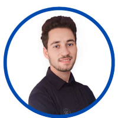

# lab-markdown
## Travaile a faire: 
Nous allons rédiger un CV comprenant nos informations personnelles et professionnelles.

### Critères de validation

- Ulisant li titre 
- utilisant les list
- utilusant image
- utilisant les liens

## Références

- [GitHub markdown Docs](https://docs.github.com/en/get-started/writing-on-github/getting-started-with-writing-and-formatting-on-github/basic-writing-and-formatting-syntax)

---

# Jalil Betroji

## Full Stack Développeur 

[LinkedIn](https://www.linkedin.com/in/jalil-betroji/) | [Twitter](https://twitter.com/JBetroji?t=3417xOWUeNkE_yETpzeGUg&s=09) | [GitHub](https://github.com/Jalil-Betroji)

---

## Résumé
Etudiant de devlopment Web a SOLICODE Tanger, j'e suis Full-Stack développeur  sur différents Framework. Je suis actuellement à la recherche d'un stage

---

## Compétences Professionnels
- **Programming Languages:** JavaScript (ES6+), Python, PHP
- **Frontend:** HTML5, CSS3, React.js, Vue.js, Bootstrap
- **Backend:** Node.js, Express, Django, Laravel
- **Databases:** MySQL, MongoDB
- **Version Control:** Git, GitHub
- **Deployment:** Heroku, AWS, Docker
- **Other Tools:** VS Code, Postman, npm, Yarn

---

## Experiences
### 2021-2022 NFT Deployer 
- Fiveer.com

### 2021-2022 NFT formateur 
- Instagram et google Meet

### 2019 Digital marketeur 
- Facebook , Instagram et Google

### 2014-2018 Peindre et décorer les maisons 
- Auto-Entrepreneur

---

## Formations
### 08 2023 certificat d'une formation en entrepreneuriat et soft skills dispensée dans le cadre du programme Challengers
- ISTA Ibn Marhal, Tanger.

### 08 2023 Certificat de spécialisation (CS) de niveau 3 Développement Web
- Solicode - OFPPT
### 08 2023 Certificat de spécialisation (CS) de niveau 3 Développement Web 
- Simplon.co
### 2021 Formation professionnelle en informatique bureautique 
- Gad Académie
## 2020-2021 Blockchain Auto Formation  
- YouTube , Udemy 
### 06-2018 Baccalauréat Science de la vie et de la terre : 
- Lycée Mohamed Abderrahmane zitane 

---

## Interests
- Open-source contributions
- Continuous learning and skill development
- Technology trends and innovations

---

## Languages
- **English:** Fluent
- **French:** Conversational

---